<h1 align="center">Hi 👋, I'm Adarsh Tiwari</h1>
   

  

  

---

## 🧑‍💻 About Me

- 🤖 AI Engineer passionate about building intelligent systems with **GPT, IBM Granite, RAG & NLP**

- ☁️ Cloud Developer deploying scalable AI solutions on **IBM Cloud** for real-world impact

- 🌐 Full-Stack Developer crafting responsive web experiences with **React.js, Node.js & JavaScript**

- 📊 Data enthusiast turning complex datasets into insights through **ML models & visualization**

- 🎓 B.Tech CSE student @ **Shri Ramswaroop Memorial University** | Graduating 2027

- 🏆 Certified in **AI, Deep Learning, Generative AI & DSA** by Infosys

- 💼 Former **AI & Cloud Intern** @ IBM SkillsBuild | Shell Skills4Future

- 🔥 Currently exploring **multi-agent AI systems** and advanced **RAG implementations**

- 💡 Building open-source projects that solve real problems with **Python, Java & JavaScript**

- 🚀 Believer in "Code with purpose, build with passion, innovate with AI"

---

## 💻 Tech Stack:

  

<!-- 💻 LANGUAGES -->
<h4>💻 Languages</h4>

  
  
  
  
  
  

<!-- 🤖 AI & MACHINE LEARNING -->
<h4>🤖 AI & Machine Learning</h4>

  
  
  
  

<!-- 🌐 WEB DEVELOPMENT -->
<h4>🌐 Web Development</h4>

  
  
  
  
  
  
  
  

<!-- 🗄️ DATABASES -->
<h4>🗄️ Databases</h4>

  
  
  
  
  
  

<!-- 🔧 TOOLS & PLATFORMS -->
<h4>🔧 Tools & Platforms</h4>

  
  
  
  
  
  
  
  

---

## 🌐 Connect and Collaborate:

  

&nbsp;

&nbsp;

&nbsp;

---

## 📊 GitHub Stats:

  
  <!-- GitHub Stats + Custom Streak in ONE ROW -->
  

  &nbsp;
  
  
    
  
  <!-- 📊 REAL-TIME LANGUAGE USAGE WITH PROGRESS BARS -->
  
  
    
  
  <!-- Activity Graph -->
  
  
    
  
  <!-- Additional Stats Cards -->
  
  

  

---

## 🚀 GitHub Jet Heatmap

  

--- 

## ✍️ Random Dev Quote

  

  
  

